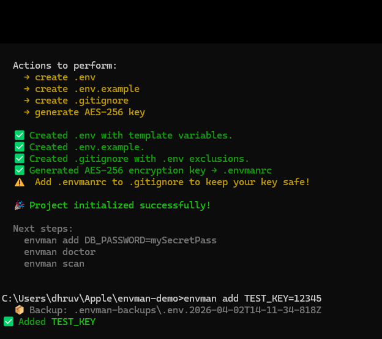
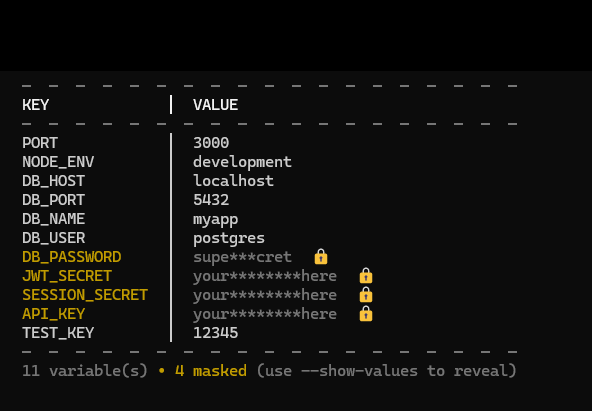
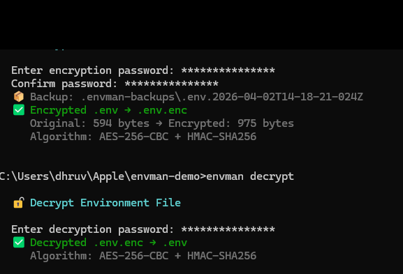

# 🛡️ Envman — Secure Environment Manager

<p align="center">
  
  
  
  
</p>

<p align="center">
  <b>🔐 Secure • ⚡ Fast • 🧠 Smart Env Management CLI</b>
</p>

> A modern CLI to manage `.env` files with encryption, secret scanning, backups, and health checks.

---

## 🔥 Feature Highlights

- **AES-256-GCM Encryption** — Military-grade encryption for your sensitive variables
- **Secret Scanner** — Detect exposed API keys and tokens before they leak
- **Health Diagnostics** — Doctor command validates your environment setup
- **Automatic Backups** — Every change is backed up before execution
- **`.env.example` Generator** — Share templates safely without exposing secrets
- **Cross-Platform** — Works seamlessly on macOS, Linux, and Windows

---

## ⚡ Why Developers Use Envman

Stop wrestling with messy `.env` files. Envman gives you a clean, secure workflow for managing environment variables across all your projects.

- Stop manually tracking which `.env` is production vs development
- Never accidentally commit secrets to version control
- Validate your environment setup before deployments
- Share environment templates with your team safely

---

## 💡 Problem vs Solution

| Problem | Solution |
|---------|----------|
| `.env` files scattered everywhere | Centralized management with `envman list` |
| Fear of committing secrets | AES-256 encryption + secret scanning |
| No backup before changes | Automatic backups before every operation |
| Unclear if env setup is correct | `envman doctor` validates everything |
| Can't share configs safely | `.env.example` generation |

---

## 🎯 Use Cases

| Scenario | How Envman Helps |
|----------|------------------|
| **Multiple Environments** | Dev, staging, production — switch configs with one command |
| **Team Collaboration** | Share `.env.example` without exposing secrets |
| **Security Audits** | Scan for leaked credentials in your codebase |
| **CI/CD Pipelines** | Validate environment health before deployments |
| **Legacy Projects** | Gradually secure messy `.env` files with backups |

---

## 🚀 Quick 10-Second Start

```bash
envman init
envman list
envman encrypt
envman doctor
```

---

## 📦 Installation

Install globally:

```bash
npm install -g @fronik/envman
```

Or use with npx (no install required):

```bash
npx @fronik/envman
```

---

## 📸 Screenshots







---

## 📚 Commands

| Command | Description |
|---------|-------------|
| `envman init` | Initialize envman in your project |
| `envman list` | List all managed environment files |
| `envman encrypt` | Encrypt a `.env` file |
| `envman decrypt` | Decrypt an encrypted file |
| `envman doctor` | Run health checks on your setup |
| `envman scan` | Scan for exposed secrets |
| `envman backup` | Create a backup of your env files |
| `envman generate` | Generate a `.env.example` file |

---

## 🎯 Project Goals

1. **Security First** — Every feature is designed to protect sensitive data
2. **Zero Surprises** — Automatic backups before any destructive operation
3. **Developer Experience** — Clean CLI with helpful feedback and validation
4. **Reliability** — Battle-tested with comprehensive test coverage

---

## 🧪 Testing

```bash
npm test
```

Tests run with Jest and include coverage reports.

---

## 📌 Project Stability

- **Tested CLI** — Comprehensive test suite with Jest
- **Stable Commands** — All commands are battle-tested and versioned
- **Secure Handling** — No secrets stored in plain text, all operations are local

---

## 🔒 Security

All encryption uses **AES-256-GCM** for maximum security. Secrets are never stored in plain text and all operations happen locally on your machine.

For vulnerability reports, please open a private security advisory on GitHub.

---

## ⚠️ README Maintenance Notes

- Screenshot images must remain in the `docs/` folder
- Image filenames must stay lowercase: `init.png`, `list.png`, `encrypt.png`
- The Installation section uses fenced code blocks — do not modify the markdown structure
- All code blocks must be properly closed with triple backticks

---

## 🚀 Built for Developers Who Care About Security

Envman is designed for developers and teams who understand that environment management shouldn't be an afterthought. It's built to be secure, reliable, and developer-friendly.

---

## 💬 Feedback & Contributions Welcome

Found a bug? Have a feature request? Contributions are welcome — open an issue or submit a pull request.

---

## ⭐ Why This Project Deserves a Star

- Solves a real problem that every developer faces
- Security-first approach with no compromises
- Active maintenance and improvements
- Clean, well-documented CLI that respects your time

---

## 🤝 Contributing

Contributions are welcome! Please feel free to submit issues or pull requests.

---

## 📄 License

MIT License — see [LICENSE](LICENSE) for details.

---

<p align="center">
  Made with ❤️ for developers who care about security
</p>
